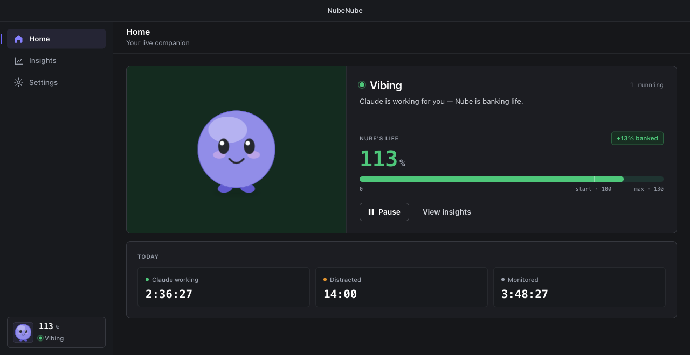
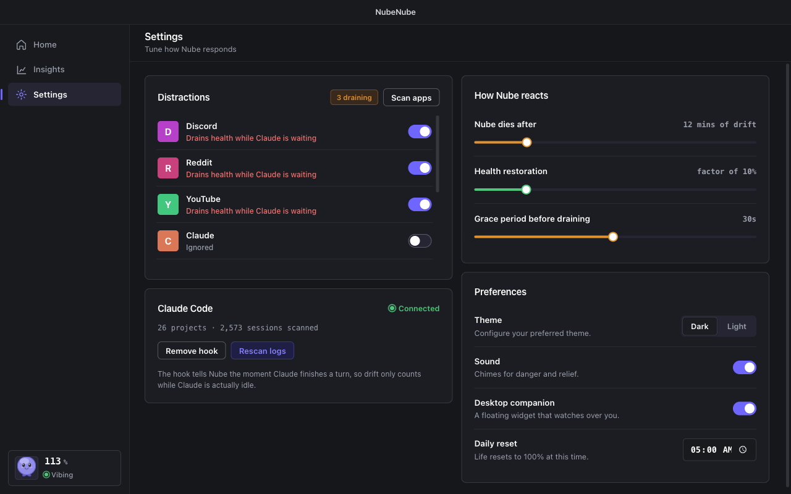
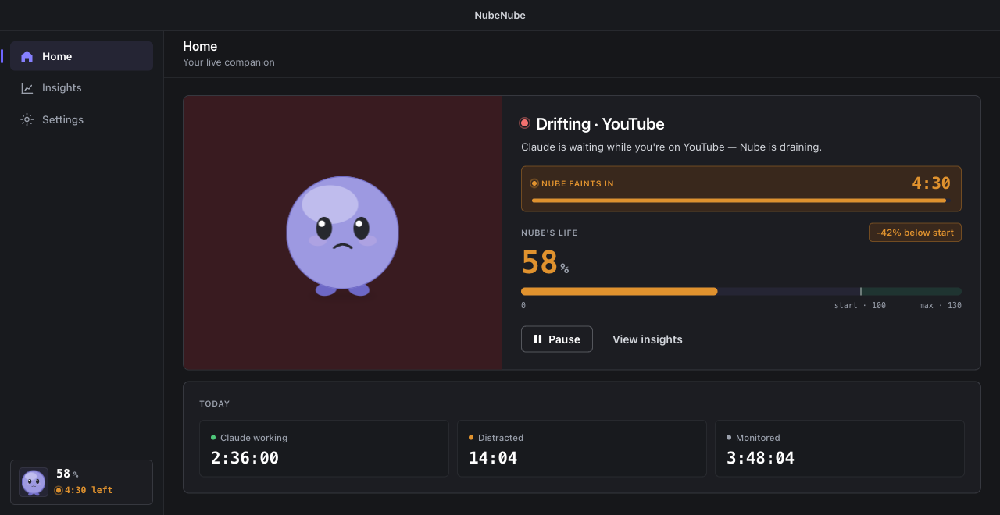
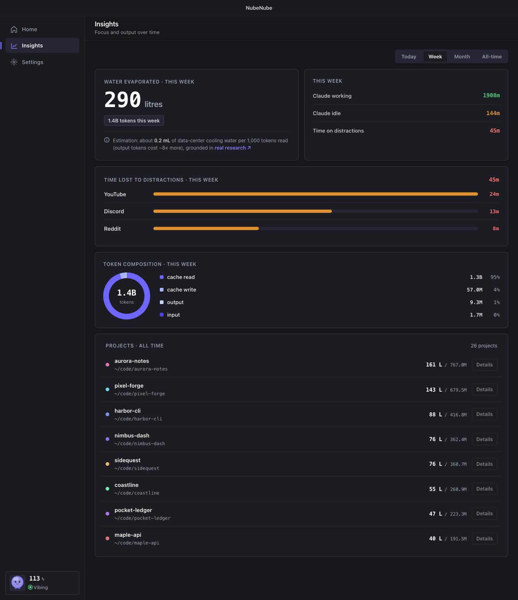
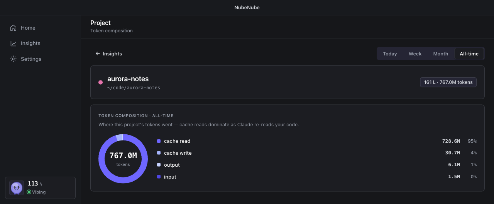
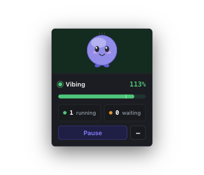
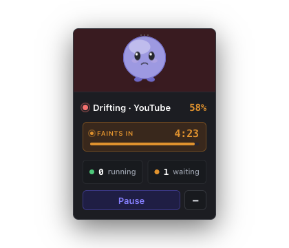
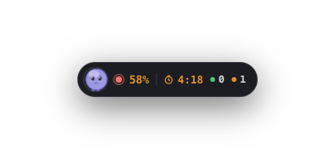

<div align="center">

# NubeNube ☁️

**A desktop focus companion for Claude Code.**

NubeNube is your friendly assistant for the one thing us vibecoders struggle with
most: drifting away from our Claude sessions to distractions. When Claude finishes
a turn and waits for you, a small cloud creature — your *Nube* — keeps you in the
loop. Reply and it's fine; wander off to YouTube or Discord and it droops until you
come back.

Local-first. No accounts, no servers, no telemetry — it reads your local `~/.claude`
data and watches which app is in front, and nothing leaves your machine.



</div>

---

## How it behaves

- **Claude works → your Nube grows.** Every token Claude reads and writes
  "evaporates" an estimated amount of water. That water is what the Nube drinks.
- **Claude finishes → it's your turn.** The hooks tell NubeNube the exact moment
  Claude hands the turn back to you.
- **You drift → your Nube drains.** Switch to a distraction app while Claude is
  waiting and the Nube loses health on a countdown. Reply or come back and it stops.
- **Idle ≠ drifting.** Step away from the keyboard and health *freezes* — being away
  isn't the same as ignoring Claude.
- **Fresh start daily.** Life resets to 100% each morning and banks up to 130% when
  you stay focused. One rough afternoon doesn't follow you into the next day.

---

## Install

Download the build for your platform from the
[Releases page](https://github.com/algebananazzzzz/nubenube/releases):

| Platform | File | Notes |
|---|---|---|
| **macOS** | `.dmg` | Drag NubeNube to Applications |
| **Windows** | `.msi` or `.exe` (NSIS) | Run the installer |
| **Linux (Ubuntu/Debian)** | `.deb` | Install with your package manager |
| **Linux (universal)** | `.AppImage` | `chmod +x`, then run |

**macOS first launch:** the `.dmg` is unsigned for now, so macOS will hesitate.
Right-click NubeNube → **Open** → **Open**. You only do this once; updates after that
install silently.

---

## Connect Claude Code

Open NubeNube, go to **Settings**, and find the **Claude Code** card. One click on
**Connect** does everything:



Behind that button, NubeNube:

1. **Scans your usage history** — reads your local Claude Code logs
   (`CLAUDE_CONFIG_DIR` → `$XDG_CONFIG_HOME/claude` → `~/.claude`, then
   `projects/**/*.jsonl`), so past projects and token totals show up immediately.
2. **Installs two hooks** — adds `Stop` and `UserPromptSubmit` hooks to
   `~/.claude/settings.json` so it knows the exact moment Claude finishes a turn.

The hook install is **non-destructive**: NubeNube backs up `settings.json` first and
preserves anything already there (existing hooks, statusline, everything).
**Remove hook** reverses it cleanly.

Once connected, the card shows a green **Connected** badge with the number of
projects and sessions it found. Start a Claude Code session as usual and the Nube
begins drinking the water those tokens evaporate.

---

## The screens

NubeNube has three places to go — Home, Insights, Settings — plus a floating
companion window.

### Home

Your live companion. The panel behind the Nube is a mood ring: its colour and the
Nube's expression both shift with the current state — calm green while Claude works,
amber when it's waiting on you, stormy red when you've drifted. The **Today** strip
tracks three live timers: **Claude working**, **Distracted**, and **Monitored**.
**Pause** freezes everything when you're taking a real break.

When you drift mid-turn, a countdown shows exactly how long until the Nube faints.

| Working | Drifting |
|---|---|
|  |  |

The state Home reports, in one sentence:

| State | Meaning |
|---|---|
| **Vibing** | Claude is working for you — Nube is banking life. |
| **Waiting** | Claude finished and is waiting on you. |
| **Drifting · {app}** | You're on a distraction while Claude waits — Nube is draining. |
| **Chillin · {app}** | You're on a distraction, but nothing is waiting — Nube is fine. |
| **Paused** | Tracking is off; nothing counts until you resume. |
| **Idle** | No active Claude sessions. |

A distraction only counts as **Drifting** (the draining kind) when Claude is actually
waiting on you. Otherwise it's **Chillin** — no health lost.

### Insights

Your token history translated into **litres of water**. Switch the range with the
tabs — **Today / Week / Month / All-time**.



- **Water evaporated** — the headline litres figure and the token count behind it.
- **Summary** — Claude working time, Claude idle time, and time lost to distractions.
- **Time lost to distractions** — a per-app bar chart of what pulls you away while
  Claude waits.
- **Token composition** — a donut splitting tokens into cache read / cache write /
  output / input. Cache reads usually dominate (often ~95%) — Claude re-reading your
  code as it works.
- **Projects** — every project you've used Claude on, ranked by water.

Click **Details** on a project for its own token composition, filterable by range:



### Desktop companion

Enable the **Desktop companion** in Settings and a small, always-on-top widget floats
over your other windows — so the nudge reaches you even when you've tabbed away, which
is exactly when it matters. Drag it by the creature to park it anywhere; click the
Nube to bring Home forward.

| Full card | Drifting | Minimised pill |
|---|---|---|
|  |  |  |

The minimised pill collapses to a strip with just life, a countdown if you're
drifting, and how many sessions are running vs. waiting.

### Settings

Defaults are sensible, so you can ignore most of this until you want to tune it.


- **Distractions** — every app NubeNube has seen, each with a toggle. **On** means it
  drains health while Claude waits; **Ignored** means it's harmless. **Scan apps**
  pulls in whatever's currently running.
- **How Nube reacts** — **Nube dies after** (minutes of drift before it faints),
  **Health restoration** (how strongly focused time heals it), and **Grace period**
  (a buffer so a quick glance away doesn't immediately count).
- **Preferences** — Theme (Dark/Light), Sound (danger and relief chimes), Desktop
  companion, and Daily reset time (5:00 AM by default).

---

## How it works

### The water model

Water is a *real volume*, estimated from your token counts. Reading is far cheaper
than writing:

| Class | tokens counted | mL / token |
|---|---|---|
| **read** | input, cache_read, cache_creation | **0.0002** |
| **write** | output | **0.0015** |

```
water_mL = 0.0002 × (input + cache_read + cache_create) + 0.0015 × output
```

The rates are order-of-magnitude estimates from the AI water-footprint literature
(and tunable in Settings):

- Li, Yang, Islam & Ren, *Making AI Less "Thirsty"* — [arXiv:2304.03271](https://arxiv.org/abs/2304.03271)
- Jegham et al., *How Hungry is AI?* — [arXiv:2505.09598](https://arxiv.org/abs/2505.09598)

### Where the data comes from

A small Rust connector reads your local Claude Code logs and recursively scans
`projects/**/*.jsonl`. It keeps only real assistant usage, **deduplicates by
`(message.id, requestId)`** (naive sums overcount by 1.7–3.9×), attributes each
message to its project, and stores daily/monthly totals in a local SQLite database.

### How drift is detected (never the network)

The hook installer adds `Stop` and `UserPromptSubmit` hooks to
`~/.claude/settings.json`. Those report the exact moment Claude finishes a turn. A
~2-second watcher then reads the frontmost app and your idle time — both
zero-permission on macOS — and runs the state machine that drives the Nube's health.
Being *idle* freezes health; away isn't the same as drifting.

### The life model

Each morning the Nube's life resets to **100%**. Keep Claude busy and stay focused
and it banks bonus life up to **130%**. Drift while Claude waits and it drains toward
0, moving through these moods on the way down:

| Life | Mood |
|---|---|
| 124%+ | Thriving |
| 100–123% | Content |
| 80–99% | Alert |
| 55–79% | Worried |
| 30–54% | Gasping |
| 8–29% | Fading |
| under 8% | Faint |

---

## Build from source

```bash
npm install
npm run tauri dev      # full desktop app (Vite dev server + Rust)
npm run dev            # frontend only, in a browser (uses mock data)
npm run tauri build    # production binaries
```

Rust tests: `cargo test --manifest-path src-tauri/Cargo.toml`. Every screen falls
back to mock data when it isn't connected, so the UI is fully navigable in a plain
browser.

```
src/                  React + TypeScript UI
  pages/              Home, Insights, ProjectDetail, Settings
  components/         AppShell, Companion, NubeCreature, ui
  lib/derive.ts       FocusTick → mood / sky / life / countdown
  lib/api.ts          Tauri bridge + mock fallback
  store/              zustand: usage / focus / settings / prefs
src-tauri/src/        Rust native layer
  connector.rs db.rs water.rs        usage ingestion + water model
  watcher.rs drift.rs notify.rs      drift state machine
  hooks_installer.rs events_tail.rs  Claude Code hook bridge
  commands.rs lib.rs                 IPC + tray + companion window
```

## Releases

- **Beta** (`vX.Y.Z-beta`) — published automatically on every merge to `main`.
- **Stable** (`vX.Y.Z`) — promoted manually via GitHub Actions. Installed apps
  auto-update silently.

### First-time release setup

Before the release workflow can sign builds, generate a signing keypair:

1. `cargo tauri signer generate -w ~/.tauri/nubenube.key`
2. Copy the public key into `src-tauri/tauri.conf.json` → `plugins.updater.pubkey`
3. Set the real `OWNER/repo` in `plugins.updater.endpoints[0]`
4. Add repo secrets `TAURI_SIGNING_PRIVATE_KEY` (the key file's contents) and
   `TAURI_SIGNING_PRIVATE_KEY_PASSWORD` (its passphrase)
</content>
</invoke>
